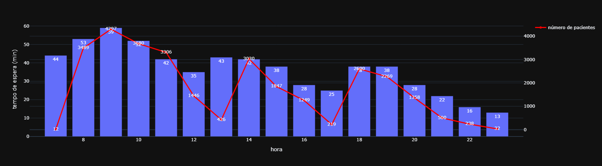
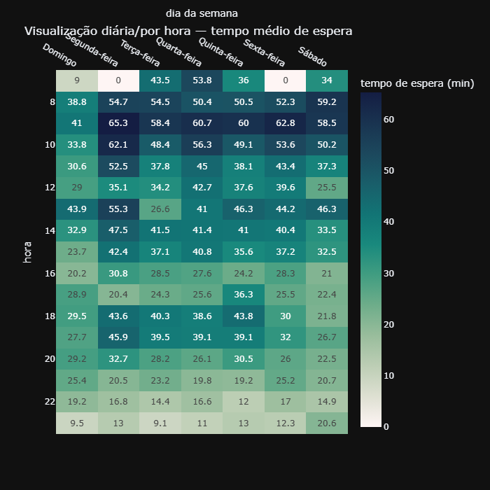
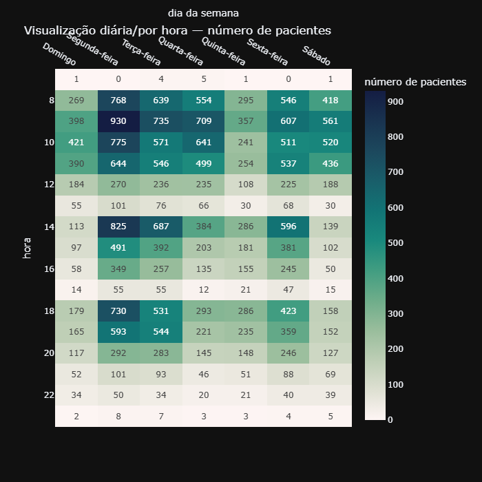
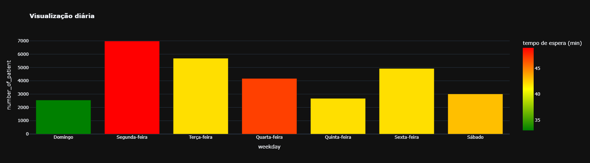
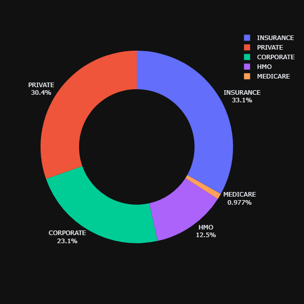

# Atendimento Hospitalar — PySpark

Análise exploratória e estimativas de capacidade de atendimento hospitalar usando **PySpark**, com base no dataset [Hospital Patient Data](https://www.kaggle.com/datasets/abdulqaderasiirii/hospital-patient-data) do Kaggle.

O notebook [`atendimento-hospitalar.ipynb`](atendimento-hospitalar.ipynb) reproduz, usando PySpark (em vez de pandas puro), a análise de tempo de espera do notebook, e complementa com uma estimativa de dimensionamento de equipe usando `RandomForestClassifier` (scikit-learn).

## O que o notebook faz

1. **Ingestão de dados**: baixa o dataset via `kagglehub` e carrega a planilha Excel com pandas, tratando colunas com tipos mistos e horários.
2. **Consultas com PySpark**: cria uma `SparkSession` local e explora os dados (receitas, custos, tempos de atendimento) usando a API do PySpark.
3. **Análise de tempo de espera**:
   - O tipo de paciente afeta o tempo de espera?
   - Estamos muito ocupados? Em quais horários/dias?
   - Quanto tempo os pacientes esperam antes do médico?
   - Que tipo de equipe precisamos e onde?
4. **Estimativas com Machine Learning**: treina um `RandomForestClassifier` para identificar os fatores que mais influenciam horas de "alta espera", e estima quantos médicos adicionais seriam necessários para reduzir a espera em pelo menos 30%, junto com o impacto esperado em número de atendimentos e em `Consultation Revenue`.
5. **Dataset complementar sintético**: [`dataset/escala_medicos.csv`](dataset/escala_medicos.csv) simula uma escala de médicos por data/hora (para fins de estudo, já que o dataset original não traz essa informação), usada para refinar as estimativas de dimensionamento de equipe.

## Visualizações

Os gráficos a seguir ilustram os principais resultados da análise:

### Tempo de espera por hora do dia



### Tempo de espera por dia da semana



### Número de pacientes por dia da semana



### Número de pacientes vs Tempo de espera



### Classe financeira



### Processo % vs Consulta %


## Requisitos

- Python 3.10+
- Java 11 ou 17 (configure `JAVA_HOME` para o caminho da sua instalação)
- Windows: evite instalar o projeto em um caminho com caracteres acentuados/espaços — o launcher do Spark pode falhar ao montar o classpath nesses casos

## Configuração

```powershell
python -m venv .venv
.venv\Scripts\Activate.ps1
pip install -r requirements.txt
```

Defina `JAVA_HOME` para uma instalação do Java 11/17 antes de rodar o notebook (a primeira célula do notebook faz isso automaticamente, ajuste o caminho conforme seu ambiente).

## Executando

Abra [`atendimento-hospitalar.ipynb`](atendimento-hospitalar.ipynb) no VS Code (ou Jupyter) e execute as células em ordem, do início ao fim.

## Estrutura

```
atendimento-hospitalar.ipynb   # notebook principal
charts/                          # gráficos gerados pela análise
  tempo_espera_hora_plot.png
  dia_da_semana_tempo_espera_plot.png
  dia_da_semana_numero_pacientes_plot.png
  number_of_patiente_x_tempo_espera_plot.png
  financial_class_plot.png
  process_perc_x_consultation_per_plot.png
dataset/
  escala_medicos.csv             # escala sintética de médicos (complementar)
requirements.txt
```

## Dados

O dataset original é baixado automaticamente via `kagglehub` na primeira execução do notebook (não é necessário baixá-lo manualmente).
